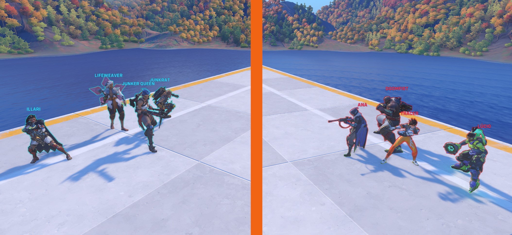

Reballanced and improved Overwatch **4v4 All Heroes** mode.

CODE: 48CYD

Differences between this and what is currently used ([original script](https://github.com/domuspopus/overwatch-4v4-all-heroes/blob/48df90949be856888b5e3db5ca1917e87e950997/main.ow)) in Overwatch 2:

- All new Overwatch 2 heroes are included.
- Ana can nano herself if no target is selected.
- Hammond can grapple onto thin air.
- Junkrat can ult mid-air.
- D.Va does not have never-ending bombs.
- Several tanks have reduced HP.
- Moira and Roadhog start without an ultimate ready.
- Heroes wont fly too far away from map.

Changelog:

### 1.3

- Allow Junkrat to ult in mid-air.
- Fix D.Va having instant ult on re-mech (constant D.Va explosions).
- Re-enable HP/Damage auto-ballancing for 2+ players teams.
- Nerf HP/Damage auto-ballancing (from +50% Damage to +25%).
- Character ballance changes:
    - Soldier: start with some % of ult instead of full, decrease ult duration.
    - Mercy: decrease HP, increase resurrection cooldown.
    - Junkrat: increase mines knockback.
    - Hammond: slightly increase grapple knockback.
    - Zarya: slightly increase HP.
    - Orisa: decrease HP.
- Shorter / better UI messages.
- Increase 1v1 time limit.
- Various fixes.

### 1.2

- Add team sizes ballancing between rounds.
- Add measures to prevent overly long 1v1s (e.g Moira vs Moira).
- Restrict HP/Damage auto-ballancing only to teams with a single player.
- Improvements to anti-fly rules.
- Decrease ultimate generation rate (280% -> 200%).
- Nerf Moira HP and cooldowns.

### 1.1

- Add trolling prevention (anti-fly rules).
- Ensure faux abilities are affected by "hacked" etc. status effects.
- Increase Hammond cooldowns.

### 1.0

- Initial version.
