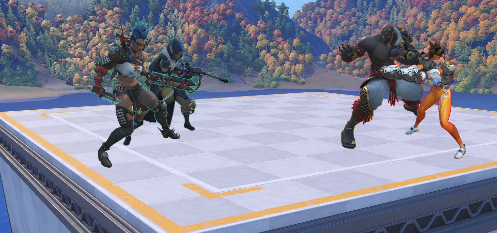

Reballanced and improved Overwatch **4v4 All Heroes** mode (alias **J-edit**, code 48CYD).

---

Main differences from the [older script](https://github.com/domuspopus/overwatch-4v4-all-heroes/blob/48df90949be856888b5e3db5ca1917e87e950997/main.ow) which is often used in Overwatch custom games:

- All new Overwatch 2 heroes are included.
- Ana can nano herself if no target is selected.
- Hammond can [grapple onto thin air](preview-ball-grapple.gif).
- Junkrat can [ult mid-air](preview-junk-ult.gif).
- D.Va does not have never-ending nukes.
- Heroes wont fly too far away from map.
- Overly tanky characters have reduced HP.
- Team sizes ballancing between rounds.

### Mode description

Endless 4v4 Elimination quick rounds on a small flat map. Characters are picked randomly and start with an ultimates ready or a high ultimate charge. Ability cooldowns are largely reduced. Perfectly playable as 1v1, 1v2, 2v2, etc. In case of team size imballance, the smaller team will have buffed HP and damage.

Mode [workshop.codes](https://workshop.codes/48CYD) page.

### Configuration

Anything that isn't a simple setting (e.g. HP of a character) can be turned off by disabling workshop rule associated with it. All rules have descriptive names. For instance to disable Ana self ult ability, find a rule named "Hero: Ana (self ult)", tick the checkbox on the side of it and toggle the rule off using the button atop the interface.

### Changelog

#### 1.5

- Increase HP/Damage auto-ballancing for a team of 1.
- Allow Echo to be affected by some faux abilities and effects (e.g. Ana self-ult, Hammond icicle grapple) when she is duplicating.
- Improve character tips and make all of them show on death and between rounds.
- Allow for ultimate generation during start of the round (via custom workaround).
    - This is due to a limitation of Elimination mode, first ~3 seconds of a round disallow ultimate generation.
    - Currently only important for McCree and Soldier.
- Character ballance changes:
    - Soldier: increase starting ult charge %, decrease ult duration.
    - Zarya: increase HP.
    - Lifeweaver: decrease petal plate HP, decrease Tree of Life HP and halve its duration.
    - Winston: increase shield cooldown, decrease shield HP.
    - McCree: require him to land a couple shots to build 100% ult charge.
    - Rein: increase passive ult generation rate.
    - Hammond: slightly increase piledriver damage.
- Include daytime version of the map.
- Add server load debug view (interact + reload).
- Various fixes.

#### 1.4

- Rework Hammond icicle grapple for a more consistent and reliable mechanic.
- Buff Hammond piledriver damage and knockback.
- 1v1 time limit improvements, HUD indication for it.
- Various fixes.

#### 1.3

- Allow Junkrat to ult in mid-air.
- Fix D.Va having instant ult on re-mech (constant D.Va explosions).
- Re-enable HP/Damage auto-ballancing for 2+ players teams.
- Nerf HP/Damage auto-ballancing (decrease damage multiplier).
- Prevent premature game completion (e.g. entire one team leaving).
- Character ballance changes:
    - Soldier: start with some % of ult instead of full, decrease ult duration.
    - Mercy: decrease HP, increase resurrection cooldown.
    - Junkrat: increase mines knockback.
    - Hammond: increase grapple knockback, dont create icicle too close, decrease cooldowns.
    - Zarya: slightly increase HP.
    - Orisa: decrease HP.
    - Roadhog: decrease HP.
    - Widowmaker: decrease ability cooldowns.
- Shorter / better UI messages.
- Increase 1v1 time limit.

#### 1.2

- Add team sizes ballancing between rounds.
- Add measures to prevent overly long 1v1s (e.g Moira vs Moira).
- Restrict HP/Damage auto-ballancing only to teams with a single player.
- Improvements to anti-fly rules.
- Decrease ultimate generation rate (280% -> 200%).
- Nerf Moira HP and cooldowns.

#### 1.1

- Add trolling prevention (anti-fly rules).
- Ensure faux abilities are affected by "hacked" etc. status effects.
- Increase Hammond cooldowns.

#### 1.0 (changes compared to original script)

- Initial version.
- Decrease some tanks HP (Winston/Orisa/Zarya/Hammond/Roadhog).
- Mildly changed ultimate generation values, cleaned up remnants of original "4v4 Nanoblade" in that regard. 
- Roadhog and Moira spawn with no ult ready initially (but can build it).
- Increase Winston damage.
- Let Ana use ult on herself.
- Let Hammond grapple onto nothing (on the fly creating Mei icicle).
